## 🌟 Hi there!

You can call me **Felix** — or *whatever you like*! 🌈

**13** years old · indie developer & multi-AI orchestrator

  

Based in **Beijing, China**. English? **Fluent — C1.** I read, write, and ship in it every day.

### 🛠️ What I build with:

### 🚀 What I'm building
- **AutoDirector** — an AI video-agent console that turns one brief into a finished film through a multi-agent pipeline.
- **AT Group Chat** — a multi-agent group chat where AIs actually collaborate, not just take turns.
- ...plus a steady pile of bots, tools, and experiments.

### 🎯 How I code
Three things I care about:
1. **Ship it for real.** "Should work" isn't done — *verified running* is.
2. **AI as a force multiplier.** I orchestrate fleets of agents, but I own the result.
3. **Minimal scope, maximum signal.** Do exactly what's asked — and do it well.

> It's not done until I've actually run it.

### 📊 GitHub Stats & Activity

### 🐍 My Contribution Snake

My moves prove I'm alive! 🎉

<picture>
  <source media="(prefers-color-scheme: dark)" srcset="https://raw.githubusercontent.com/Felix201209/Felix201209/output/github-contribution-grid-snake-dark.svg">
  <source media="(prefers-color-scheme: light)" srcset="https://raw.githubusercontent.com/Felix201209/Felix201209/output/github-contribution-grid-snake.svg">
  
</picture>

### 🌈 Fun Fact
> 🧒 + 🤖 × ∞ → 🚀

I'm 13, and I command more AI agents than I have classmates.

---
